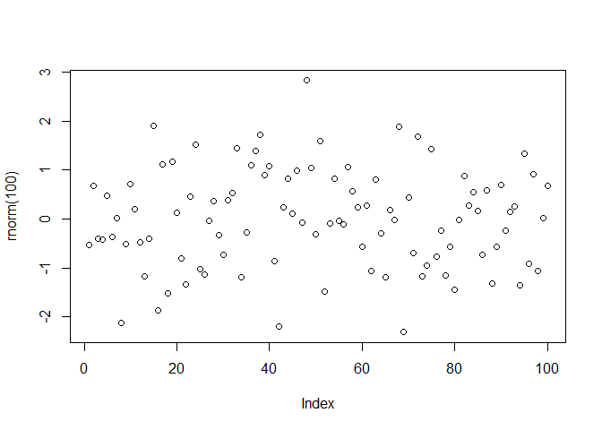

<!-- README.md is generated from README.Rmd. Please edit that file -->

# demopkg

<!-- badges: start -->

<!-- badges: end -->

The goal of `demopkg` is to provide some demonstrations of R functions
and so vignettes.

## Installation

You can install the development version of demopkg from
[GitHub](https://github.com/nikdraka/demopkg) with:

``` r
devtools::install_github("https://github.com/nikdraka/demopkg")
```

## Example

This is a basic example which shows you how to solve a common problem:

``` r
library(demopkg)

M <- make_data()
```

Use this code like this…

``` r
plot(rnorm(100))
```


